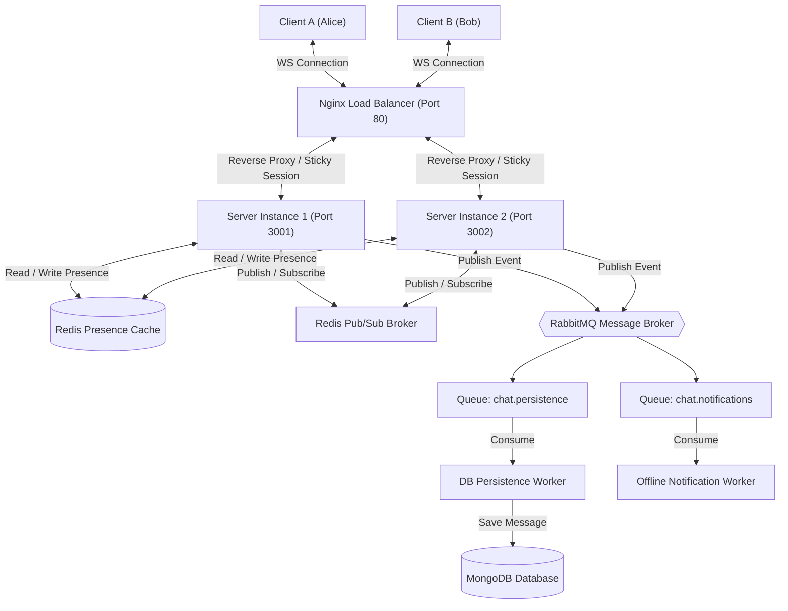
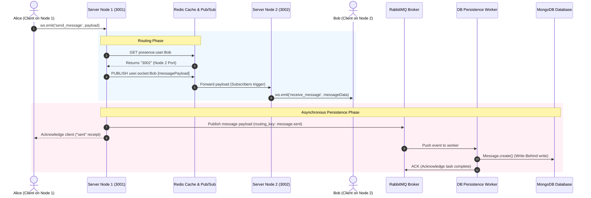

# Pulse: System Design Documentation (HLD & LLD)

This document provides a comprehensive breakdown of the **Pulse Horizontally Scalable Chat & Notification System**. It is designed specifically to help you understand the architecture, data flows, and design trade-offs of a real-world production-grade backend.

---

## 1. What Are We Building? (Concept Overview)
In a simple chat application, you have one server. All users connect to it. If User A sends a message to User B, the server simply forwards it.
However, **a single server has physical limitations** (memory, CPU, and maximum TCP connections). To support millions of users, we must scale out horizontally by running **multiple server instances** (Node 1, Node 2, etc.) behind a load balancer.

This introduces three core system design problems:
1.  **Node Discovery (Presence)**: If Alice is connected to Server Node 1, and Bob is connected to Server Node 2, how does Server 1 know where Bob is to send him a message?
2.  **Inter-Server Communication**: How does Server 1 forward the message to Server 2 so Server 2 can deliver it to Bob?
3.  **Database Bottleneck (Write-Behind)**: In a high-traffic app, writing every single chat message directly to a disk-based database (like MongoDB) synchronously will crash the database due to write-spike saturation. How do we buffer writes to protect the database?

**Pulse** solves these problems using:
*   **Nginx Load Balancer**: Distributes users across server instances.
*   **Redis Presence Cache**: Keeps track of which user is connected to which server.
*   **Redis Pub/Sub**: Bridges server instances together (acts as an inter-server courier).
*   **RabbitMQ Message Broker**: Buffers message persistence tasks (write-behind queue) and processes offline alerts (notifications queue) asynchronously.
*   **MongoDB**: Sturdy, structured document database for historical query retrievals.

---

## 2. High-Level Design (HLD)

The High-Level Design focuses on the system components, boundaries, and how they connect to form a cohesive network.

### Architectural Diagram



### Component Roles
*   **Nginx**: Acts as the single entrypoint. It receives HTTP and WebSocket requests on Port 80 and forwards them to Node 1 or Node 2. It uses `ip_hash` (sticky sessions) so that once a socket handshakes, it stays connected to the same backend node.
*   **WebSocket Servers (Node 1 & 2)**: Light stateless servers that maintain active persistent TCP socket connections with browsers.
*   **Redis**:
    *   *Presence*: Stores key-values like `presence:user:alice -> 3001` with a short-lived expiration (TTL).
    *   *Pub/Sub*: If Node 1 wants to talk to Node 2, it publishes a message on a channel Node 2 is subscribed to.
*   **RabbitMQ**: A message queue that acts as a buffer. If the system receives 10,000 messages per second, RabbitMQ absorbs them instantly. The background workers can then write them to MongoDB at a steady, controlled pace (e.g. 500 writes/sec), ensuring the database never gets overwhelmed.
*   **MongoDB**: Stores structured users, conversation rooms, and historical chat messages.

---

## 3. Data Flow Diagram (DFD)

A Data Flow Diagram shows how information moves through processes.

### Level 1 DFD: Send Message Flow



## 4. Low-Level Design (LLD)

LLD details the code-level interfaces, schemas, routing states, and exact programmatic behaviors.

### A. Connection Lifecycle (Step-by-Step Code Execution)
1.  **Handshake**: Client connects to Port 80. Nginx proxies the connection to Port 3001 or 3002.
2.  **Authentication**: `socketManager.js` intercept connection request -> Extract JWT token -> Decrypt JWT using `JWT_SECRET` -> Query User model from MongoDB -> Grant/Reject Connection.
3.  **Presence Registration**:
    *   `socketManager.js` registers: `presence:user:<userId> -> <PORT>` in Redis cache with an expiration of 30 seconds.
    *   The client browser initiates a `heartbeat` timer. Every 15 seconds, the client sends a small socket ping. The server receives this heartbeat and resets the Redis presence TTL back to 30 seconds.
4.  **Channel Subscription**:
    *   `redisPubSub.js` instructs the Redis Subscriber Client to subscribe to the channel string: `user.socket:<userId>`.
    *   This server instance is now listening for any messages sent by other server nodes intended for this user.

### B. Message Event Handling Logic
When `socket.on('send_message')` is triggered on Node 1:

```
                  ┌──────────────────────┐
                  │ Message Received     │
                  │ on Socket Node 1     │
                  └──────────┬───────────┘
                             │
                             ▼
              ┌─────────────────────────────┐
              │  GET presence:user:recipient│
              │  from Redis Cache           │
              └──────────────┬──────────────┘
                             │
              ┌──────────────┴──────────────┐
              ▼                             ▼
       [Recipient Port Found]       [No Presence Found]
              │                             │
       ┌──────┴──────┐                      ▼
       ▼             ▼          ┌─────────────────────────────┐
  [Same Node]  [Different Node] │ Publish to RabbitMQ Queue   │
  (Port 3001)    (Port 3002)    │ 'chat.notifications'        │
       │             │          └─────────────────────────────┘
       ▼             ▼
┌────────────┐ ┌────────────────────────┐
│Deliver     │ │Publish message to      │
│Socket      │ │Redis Pub/Sub channel:  │
│Directly    │ │'user.socket:recipient' │
└────────────┘ └────────────────────────┘
```

---

## 5. Minute Details Explained (Why This Design?)

### Why not write directly to MongoDB?
Writing directly to MongoDB blocks the main Node.js thread because it waits for disk acknowledgement. If 5,000 users send messages at once, your Node servers will freeze waiting for database writes. 
Using **RabbitMQ**, we write the message to memory instantly, acknowledge the user's socket, and offload the actual database write to background worker threads. This pattern is called **Write-Behind Caching** or **Asynchronous Database Decoupling**.

### Why do we need Redis Pub/Sub?
WebSockets are **stateful TCP connections**. A socket exists only in the RAM of the server instance the client connected to. If Bob is on Server 2, Server 1 cannot write to Bob's socket because Server 1 doesn't have it in RAM. 
We use **Redis Pub/Sub** as a virtual bus. Node 1 prints: "Couriers, deliver this message to user.socket:Bob". Redis receives it and instantly broadcasts it to Node 2. Node 2 (which is subscribed to Bob's channel) catches it and writes it directly to Bob's socket.

### Why do we need Nginx `ip_hash`?
WebSocket connection starts as a normal HTTP Request, which is then upgraded via headers (`Upgrade: websocket`). 
If a load balancer doesn't have sticky sessions, the initial upgrade handshake might hit Server 1, but the subsequent WebSocket traffic might try to hit Server 2. Since Server 2 has no record of the handshake, the connection drops. `ip_hash` binds the user's IP to the same server node.


pulse/

docker-compose.yml
package.json
.env

src/

├── config/
│   ├── utils.js
│   ├── db.js
│   ├── redis.js
│   ├── rabbitmq.js
│   └── logger.js
│
├── shared/
│   ├── constants/
│   │   └── index.js
│   ├── errors/
│   │   └── index.js
│   └── middleware/
│       ├── auth.js
│       └── error.js
│
├── utils/
│   ├── response.js
│   ├── retry.js
│   ├── sleep.js
│   └── generateUUID.js
│
├── models/
│   ├── User.js
│   ├── Conversation.js
│   └── Message.js
│
├── services/
│   ├── auth/
│   │   └── authService.js
│   ├── socket/
│   │   ├── socketManager.js
│   │   └── redisPubSub.js
│   └── queue/
│       └── publisher.js
│
├── workers/
│   ├── dbConsumer.js
│   └── notifConsumer.js
│
├── routes/
│   └── index.js
│
├── public/
│   ├── index.html
│   ├── styles.css
│   └── app.js
│
├── app.js
└── server.js
